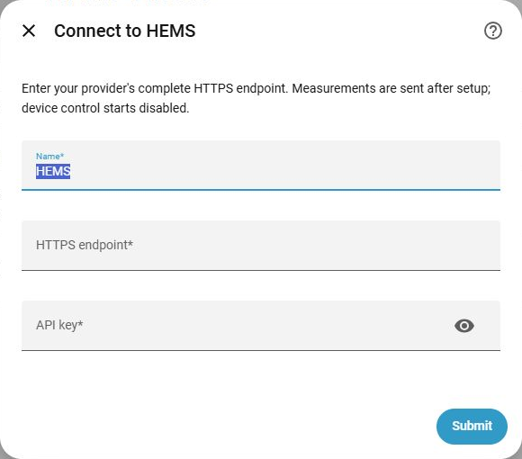
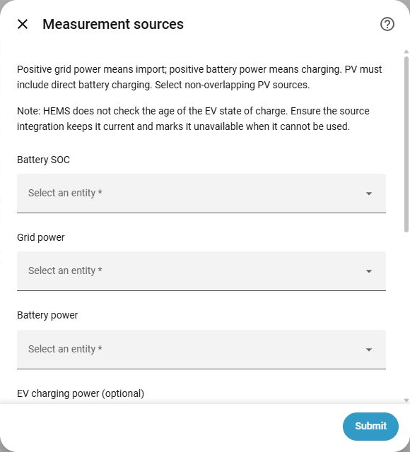
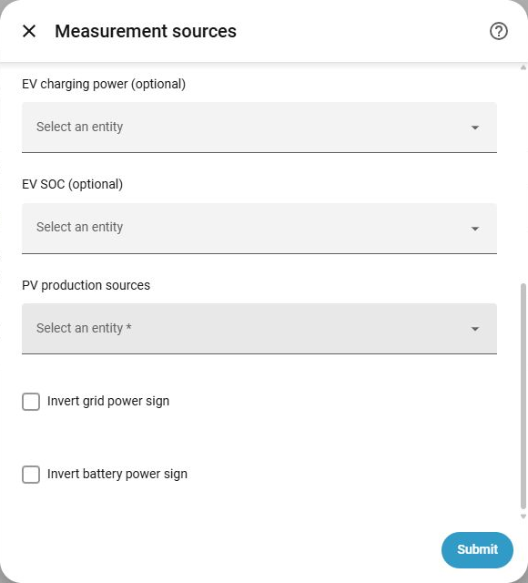
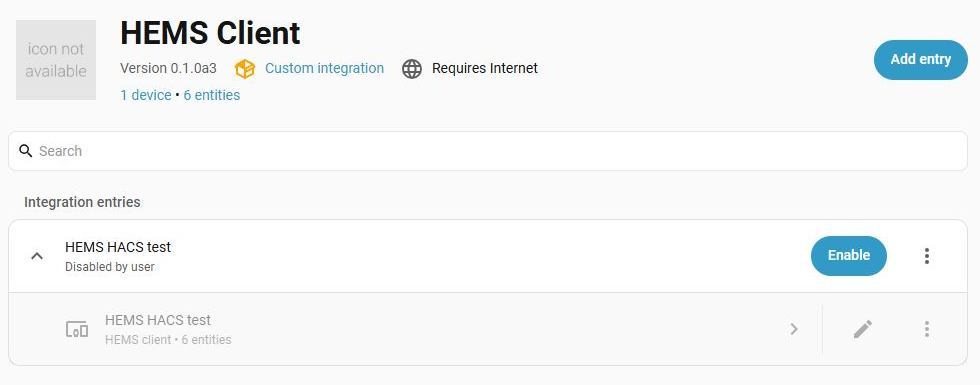

# Configuration screenshots / Konfigurationsbilder

These are real Home Assistant 2026.9.3 dialogs, captured with HEMS Client
0.1.0a3 on 2026-09-27. Only the relevant UI area is cropped; the dialogs are
not mockups. Fields are empty to avoid publishing household configuration or
credentials. The frontend language in these captures is English; the integration
also provides Swedish translations.

Detta är riktiga dialoger från Home Assistant 2026.9.3 med HEMS Client 0.1.0a3.
Bilderna är beskurna till relevant område. Fälten visas tomma för att inte
publicera privata sensorval eller inloggningsuppgifter. Integrationen har även
svenska översättningar.

## Connection / Anslutning

## Measurement sources / Mätkällor

The sensor selector is scrollable. EV SOC freshness belongs to the source
integration; there is no configurable EV SOC timeout.

Sensorformuläret är rullningsbart. Bilens källintegration ansvarar för att SOC
är aktuellt; det finns ingen inställning för SOC-timeout för bilen.

## Disabled test installation / Inaktiverad testinstallation

Installation through HACS, config creation, options saving and unloading were
checked on this HA version. The test entry was left disabled with its real
measurement sources saved and no control adapter configured. An invalid required
source prevented telemetry during initial setup; the real source was saved only
after disabling the entry. The existing controller remained separate.

This validates installation/configuration only. It does not validate live cloud
exchanges, hardware control, or compatibility across all supported HA versions.

Installation via HACS, skapande av konfiguration, sparande av alternativ och
inaktivering har kontrollerats. Testposten lämnades avstängd med sparade mätkällor
och utan styradapter. Ingen parallell telemetri eller hårdvarustyrning testades.
